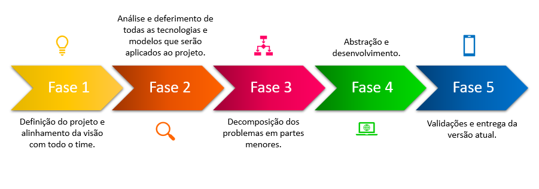
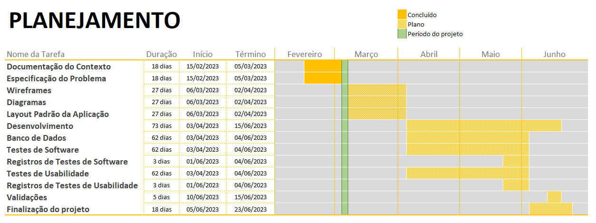

# Especificações do Projeto

Definição do problema e ideia de solução a partir da perspectiva do usuário. É composta pela definição do  diagrama de personas, histórias de usuários, requisitos funcionais e não funcionais além das restrições do projeto.

Apresente uma visão geral do que será abordado nesta parte do documento, enumerando as técnicas e/ou ferramentas utilizadas para realizar a especificações do projeto

## Personas
   <table>
        <tr>
            <td rowspan="2"></td>
            <td colspan="2"><strong>Matheus Marinho</strong></td>
        </tr>
        <tr>
            <td><strong>Idade:</strong>21 <strong>Ocupação:</strong>Estudante Universitário</td>
            <td>
                <strong>Aplicativos</strong>
                <ul>
                    <li>Facebook</li>
                    <li>Instagram</li>
                    <li>Uber</li>
                    <li>iFood</li>
                </ul>
            </td>
        </tr>
        <tr>
            <td>
                <strong>Motivações</strong>
                <ul>
                    <li>Melhor planejamento do pedido, sem precisar tomar decisões impulsivas; </li>
                    <li>Conhecimento prévio do cardápio sem mesmo precisar ir ao estabelecimento; </li>
                </ul>
            </td>
            <td>
                <strong>Frustações</strong>
                <ul>
                    <li>Fotos do menu em baixa qualidade</li>
                    <li>Cardápio desatualizado</li>
                </ul>
            </td>
            <td>
                <strong>Hobbies, História</strong>
                <ul>
                    <li>Gosta de tocar guitarra</li>
                    <li>Degustar vários rótulos de cerveja</li>
                </ul>
            </td>
        </tr>
   </table>

   <table>
        <tr>
            <td rowspan="2"></td>
            <td colspan="2"><strong>Luiz Felipe Almeida</strong></td>
        </tr>
        <tr>
            <td><strong>Idade:</strong>42 <strong>Ocupação:</strong>Advogado</td>
            <td>
                <strong>Aplicativos</strong>
                <ul>
                    <li>Twitter</li>
                    <li>Instagram</li>
               </ul>
            </td>
        </tr>
       <tr>
            <td>
                <strong>Motivações</strong>
                <ul>
                    <li>Rapidez da escolha</li>
                    <li>Menores chances de erros nos pedidos </li>
                </ul>
            </td>
            <td>
                <strong>Frustações</strong>
                <ul>
                    <li>Esperar o garçom trazer o cardápio</li>
                    <li>Cardápios sujos e rasurados</li>
                </ul>
            </td>
            <td>
                <strong>Hobbies, História</strong>
                <ul>
                    <li>Jogar futebol com os amigos</li>
                    <li>Ler quadrinhos</li>
                </ul>
            </td>
        </tr>
   </table>

   <table>
        <tr>
            <td rowspan="2"></td>
            <td colspan="2"><strong>Samanhtha Boaventura</strong></td>
        </tr>
        <tr>
            <td><strong>Idade:</strong>34 <strong>Ocupação:</strong>Engenheira Química</td>
            <td>
                <strong>Aplicativos</strong>
                <ul>
                    <li>Instagram</li>
                    <li>Uber</li>
                    <li>iFood</li>
                </ul>
            </td>
        </tr>
        <tr>
            <td>
                <strong>Motivações</strong>
                <ul>
                    <li>Facilidade em achar pratos ou bebidas de seu gosto mais rapidamente com filtros</li>
                    <li>Compartilhar cardápio em um grupo de amigos ou família para escolher de forma mais rápida o que pedir</li>
                </ul>
            </td>
            <td>
                <strong>Frustações</strong>
                <ul>
                    <li>Cardápios feitos com materiais de baixa qualidade</li>
                    <li>Itens em falta no estabelecimento</li>
                </ul>
            </td>
            <td>
                <strong>Hobbies, História</strong>
                <ul>
                    <li>Degustação de drinks</li>
                    <li>Viajar para conhecer novas culturas culinárias</li>
                    <li>Prática de Yoga</li>
                </ul>
            </td>
        </tr>
   </table>

   <table>
        <tr>
            <td rowspan="2"></td>
            <td colspan="2"><strong>Antônio Eduardo</strong></td>
        </tr>
        <tr>
            <td><strong>Idade:</strong>50 <strong>Ocupação:</strong>Dono de bar</td>
            <td>
                <strong>Aplicativos</strong>
                <ul>
                    <li>Instagram</li>
                </ul>
            </td>
        </tr>
        <tr>
            <td>
                <strong>Motivações</strong>
                <ul>
                    <li>Flexibilidade para renovar o cardápio</li>
                    <li>Possibilidade de disponibilizar o cardápio em outros idiomas</li>
                </ul>
            </td>
            <td>
               <strong>Frustações</strong>
                <ul>
                    <li>Gastos recorrentes na atualização de preços</li>
                    <li>Atraso na entrega dos cardápios pela gráfica</li>
                    <li>Desgaste precoce do cardápio e reposição</li>
                </ul>
            </td>
            <td>
                <strong>Hobbies, História</strong>
                <ul>
                    <li>Ler livros de autoajuda</li>
                    <li>Ouvir música clássica</li>
                    <li>Cozinhar novos pratos</li>
                </ul>
            </td>
       </tr>
   </table>

## Histórias de Usuários

Com base na análise das personas forma identificadas as seguintes histórias de usuários:

|EU COMO... `PERSONA`| QUERO/PRECISO ... `FUNCIONALIDADE` |PARA ... `MOTIVO/VALOR`                 |
|--------------------|------------------------------------|----------------------------------------|
|Matheus Marinho   | Ter conhecimento prévio do cardápio sem precisar se deslocar ao estabelecimento. | Não tomar decisões por impulso.  |
|Luiz Felipe Almeida       | Analisar cada item com mais calma.  | Diminuir as chances de erro nos pedidos.  |
|Samantha Boaventura | Ter mais facilidade em encontrar pratos e bebidas de seu interesse. | Para compartilhar e se encontrar com seus amigos. |
|Antônio Eduardo | Adicionar itens ao cardápio. | Para que os clientes possam consultá-lo |

## Requisitos

As tabelas que se seguem apresentam os requisitos funcionais e não funcionais que detalham o escopo do projeto. Para determinar a prioridade de requisitos, aplicar uma técnica de priorização de requisitos e detalhar como a técnica foi aplicada.

### Requisitos Funcionais

|ID    | Descrição do Requisito  | Prioridade |
|------|-----------------------------------------|----|
|RF-001| O aplicativo deve conceder ao usuário master uma forma de login. | Alta | 
|RF-002| O aplicativo deve conceder ao usuário master a opção de cadastrar /editar/excluir itens do cardápio digital. | Alta | 
|RF-003| O aplicativo deve permitir que o usuário visualize todos os itens cadastrados no cardápio digital (sejam eles alimentos ou bebidas) por meio de fotos. | Média |
|RF-004| O aplicativo deve permitir que o usuário faça uma busca/filtre por um determinado item desejado no cardápio digital. | Média |
|RF-005| O aplicativo deve apresentar a descrição e/ou composição do item selecionado pelo usuário. | Alta |
|RF-006| O aplicativo deve conceder ao usuário a opção de avaliar determinado item do cardápio. | Média |
|RF-007| O aplicativo deve permitir que o usuário envie sugestões de forma anônima para o estabelecimento. | Baixa |
|RF-008| O aplicativo deve permitir que o usuário master visualize as sugestões anonimas enviadas pelos usuários. | Baixa |

### Requisitos não Funcionais

|ID     | Descrição do Requisito  |Prioridade |
|-------|-------------------------|----|
|RNF-001| O sistema deve ser responsivo para rodar em um dispositivos móvel. | Alta | 
|RNF-002| O aplicativo deverá estar disponível ao usuário 24h por dia. |  Alta | 
|RNF-003| O aplicativo deve conter uma interface gráfica de fácil manuseio. |  Média | 
|RNF-004| O aplicativo deve estar disponível também no idioma inglês. |  Baixa | 
|RNF-005| O aplicativo não deverá apresentar um tempo de resposta que exceda 3 segundos quando não existirem problemas relacionados à qualidade de conexão. |  Alta | 
|RNF-006| O aplicativo deve suportar vários usuários conectados de forma simultânea, não apresentando lentidão em suas funcionalidades. |  Alta | 
|RNF-007| O aplicativo será desenvolvido com React Native. |  Alta | 

## Restrições

O projeto está restrito pelos itens apresentados na tabela a seguir.

|ID| Restrição                                             |
|--|-------------------------------------------------------|
|01| O projeto deverá ser entregue até o final do semestre |
|02| O sistema deve ser desenvolvido com ferramentas e tecnologias de incrementos acordados e disponíveis para todos os integrantes que compõe o grupo. |

## Diagrama de Casos de Uso
Tendo os atores das ações definidos como usuário cliente e usuário admin, nosso diagrama de caso de uso define as sequências das ações executadas pelos atores e as relações entre essa ações e quais os valores gerados por elas. Nosso diagrama está representado na figura abaixo: 

# Matriz de Rastreabilidade

A matriz de rastreabilidade apresenta a relação entre os requisitos funcionais, caracterizando uma rastreabilidade horizontal.

## Gerenciamento da Equipe
A equipe escolheu o ***SCRUM***, uma ***metodologia ágil***, como base para o ***planejamento e gereciamento do projeto***. Esta é uma metodologia efetiva, simples e flexível para **pequenas equipes**, permitindo que o projeto sofra incrementos a cada Sprint.

### Divisão de Papéis

- **Product Owner:** Profº Mateus Cursino de Lima
- **Scrum Master:** Felipe Jorge Buzelin

**Equipe de Desenvolvimento:**
- Anderson Marques Rosa
- Matheus Estevam Nunes Cordeiro
- Samara Martins Oliveira
               
**Equipe de Design:**
- Bruno Cesar Feza Rodrigues

## Gerenciamento de Tempo
Nosso projeto é de origem acadêmica, sendo divido em sprints, onde cada etapa de desenvolvimento tem uma data pré-determinada pela Universidade. A primeira etapa deve ser entregue no dia 05 de março de 2023 e a quinta e última no dia 23 de junho de 2023.

## Gerenciamento de Tarefas

Para organização e distribuição das tarefas do projeto, a equipe está utilizando o Trello, estruturado com as seguintes listas:

- **Propriedades das Tarefas:** É a etiqueta das tarefas, ou a prioridade em que serão apresentadas sendo alta cor vermelha, média cor amarela ou baixa cor verde.

- **Backlog:** Lista ordenada de todos os requisitos que se tem conhecimento de que precisam estar no produto. Cada tarefa está associada a um 'milestone', que pressupõe uma entrega final.

- **A Fazer:** Tarefas que estão disponíveis para os desenvolvedores fazer e ninguém assumiu ainda, ou seja está separada para entrega e aguardadndo o desenvolvedor assumir a resposabilidade por ela;

- **Em Andamento:** Quando uma tarefa do Sprint Backlog tiver sido iniciada, ela é movida para cá;

- **Teste:** Aqui são movidos as tarefas prontas para teste.

- **Concluído:** todas as tarefas do sprint que já foram concluídas pela equipe de desenvolvimento.

- **Lembrete:** uma aba com as datas das próximas entregas e a referência delas. 

O quadro KANBAN do grupo no Trello está disponível através da URL: https://trello.com/b/phegKomU/quadro-kanban-aplicativo-de-card%C3%A1pio-digital e é apresentado, no estado atual, na figura abaixo:

## Gestão de Orçamento

Por se tratar de um projeto acadêmico a gestão do orçamento será fictícia com intuíto de apenas simular um orçamento real, nos permitindo figurar valores que se adequem a realidade do nosso projeto. O orçamento está descrito na imagem abaixo: 

