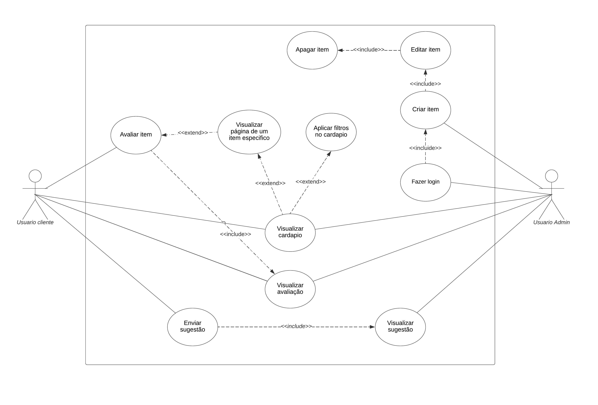

# Especificações do Projeto

Definição do problema e ideia de solução a partir da perspectiva do usuário. É composta pela definição do  diagrama de personas, histórias de usuários, requisitos funcionais e não funcionais além das restrições do projeto.

Apresente uma visão geral do que será abordado nesta parte do documento, enumerando as técnicas e/ou ferramentas utilizadas para realizar a especificações do projeto

## Personas
   <table>
        <tr>
            <td rowspan="2"></td>
            <td colspan="2"><strong>Matheus Marinho</strong></td>
        </tr>
        <tr>
            <td><strong>Idade:</strong>21 <strong>Ocupação:</strong>Estudante Universitario</td>
            <td>
                <strong>Aplicativos</strong>
                <ul>
                    <li>Facebook</li>
                    <li>Instagram</li>
                    <li>Uber</li>
                    <li>iFood</li>
                </ul>
            </td>
        </tr>
        <tr>
            <td>
                <strong>Motivações</strong>
                <ul>
                    <li>Melhor planejamento do pedido, sem precisar tomar decisões impulsivas; </li>
                    <li>Conhecimento prévio do cardápio sem mesmo precisar ir ao estabelecimento; </li>
                </ul>
            </td>
            <td>
                <strong>Frustações</strong>
                <ul>
                    <li>Fotos do menu em baixa qualidade</li>
                    <li>Cardápio desatualizado</li>
                </ul>
            </td>
            <td>
                <strong>Hobbies, História</strong>
                <ul>
                    <li>Gosta de tocar guitarra</li>
                    <li>Degustar vários rótulos de cerveja</li>
                </ul>
            </td>
        </tr>
   </table>

   <table>
        <tr>
            <td rowspan="2"></td>
            <td colspan="2"><strong>Luiz Felipe Almeida</strong></td>
        </tr>
        <tr>
            <td><strong>Idade:</strong>42 <strong>Ocupação:</strong>Advogado</td>
            <td>
                <strong>Aplicativos</strong>
                <ul>
                    <li>Twitter</li>
                    <li>Instagram</li>
               </ul>
            </td>
        </tr>
       <tr>
            <td>
                <strong>Motivações</strong>
                <ul>
                    <li>Rapidez da escolha</li>
                    <li>Menores chances de erros nos pedidos </li>
                </ul>
            </td>
            <td>
                <strong>Frustações</strong>
                <ul>
                    <li>Esperar o garçom trazer o cardápio</li>
                    <li>Cardápios sujos e rasurados</li>
                </ul>
            </td>
            <td>
                <strong>Hobbies, História</strong>
                <ul>
                    <li>Jogar futebol com os amigos</li>
                    <li>Ler quadrinhos</li>
                </ul>
            </td>
        </tr>
   </table>

   <table>
        <tr>
            <td rowspan="2"></td>
            <td colspan="2"><strong>Samanhtha Boaventura</strong></td>
        </tr>
        <tr>
            <td><strong>Idade:</strong>34 <strong>Ocupação:</strong>Engenheira Química</td>
            <td>
                <strong>Aplicativos</strong>
                <ul>
                    <li>Instagram</li>
                    <li>Uber</li>
                    <li>iFood</li>
                </ul>
            </td>
        </tr>
        <tr>
            <td>
                <strong>Motivações</strong>
                <ul>
                    <li>Facilidade em achar pratos ou bebidas de seu gosto mais rapidamente com filtros</li>
                    <li>Compartilhar cardápio em um grupo de amigos ou família para escolher de forma mais rápida o que vão pedir</li>
                </ul>
            </td>
            <td>
                <strong>Frustações</strong>
                <ul>
                    <li>Cardápios feitos com materiais de baixa qualidade</li>
                    <li>Itens em falta no estabelecimento</li>
                </ul>
            </td>
            <td>
                <strong>Hobbies, História</strong>
                <ul>
                    <li>Degustação de drinks</li>
                    <li>Viajar para conhecer novas culturas culinárias</li>
                    <li>Prática de Yoga</li>
                </ul>
            </td>
        </tr>
   </table>

   <table>
        <tr>
            <td rowspan="2"></td>
            <td colspan="2"><strong>Antônio Eduardo</strong></td>
        </tr>
        <tr>
            <td><strong>Idade:</strong>50 <strong>Ocupação:</strong>Dono de bar</td>
            <td>
                <strong>Aplicativos</strong>
                <ul>
                    <li>Instagram</li>
                </ul>
            </td>
        </tr>
        <tr>
            <td>
                <strong>Motivações</strong>
                <ul>
                    <li>Flexibilidade para renovar o cardápio</li>
                    <li>Possibilidade de disponibilizar o cardápio em outros idiomas</li>
                </ul>
            </td>
            <td>
               <strong>Frustações</strong>
                <ul>
                    <li>Gastos recorrentes na atualização de preços</li>
                    <li>Atraso na entrega dos cardápios pela gráfica</li>
                    <li>Desgaste precoce do cardápio e reposição</li>
                </ul>
            </td>
            <td>
                <strong>Hobbies, História</strong>
                <ul>
                    <li>Ler livros de autoajuda</li>
                    <li>Ouvir música clássica</li>
                    <li>Cozinhar novos pratos</li>
                </ul>
            </td>
       </tr>
   </table>

## Histórias de Usuários

Com base na análise das personas forma identificadas as seguintes histórias de usuários:

|EU COMO... `PERSONA`| QUERO/PRECISO ... `FUNCIONALIDADE` |PARA ... `MOTIVO/VALOR`                 |
|--------------------|------------------------------------|----------------------------------------|
|Matheus Marinho   | Ter conhecimento prévio do cardápio sem precisar se deslocar ao estabelecimento. | Não tomar decisões por impulso.  |
|Luiz Felipe Almeida       | Analisar cada item com mais calma.  | Diminuir as chances de erro nos pedidos.  |
|Samantha Boaventura | Ter mais facilidade em encontrar pratos e bebidas de seu interesse. | Para compartilhar e se encontrar com seus amigos. |
|Antônio Eduardo | Adicionar ítens ao cardápio. | Para que os clientes possam consultá-lo |

## Modelagem do Processo de Negócio 

### Análise da Situação Atual

Atualmente em alguns bares, restaurantes, pizzarias etc. temos problemas com disponibilidade de cardapio, seja devido a demora de atendimento pelo garçom, ou por falta mesmo do cardapio em si. Além desse problema com a disponibilidade, ainda existe o problema com a manutenção, como o ajuste de valores, recuperação de danos, inclusão/exclusão de algum item etc. Como forma de melhoria para esse processo o cardapio digital solucionaria grande parte desses problemas, já seria necessário apenas que o cliente baixe o app do estabelecimento e veja todos o cardapio, e o responsável por isso no estabelecimento faça o mesmo, porém com a função de adicionar itens ao cardapio. 

### Descrição Geral da Proposta

A proposta desenvolvida no projeto, trata-se de um app de cardapio em que os usuários possam apenas visualizar os itens, bem como seus valores, imagens, descrições etc., adicionados pelo responsável pela tarefa no estabelecimento. O projeto ficara limitado a isso devido a nível de conhecimento da equipe não ser elevado e o tempo para a capacitação e desenvolvimento não ser o suficiente. Opções de melhorias para o projeto, seria adicionar uma forma do usuário fazer um pedido baseado no número de sua mesa, ou algo do tipo, sendo assim o usuário master iria receber esse pedido e seria criado uma “comanda” digital.

### Processo 1 – Login do usuário master

Abrange o RF-001. 

### Processo 2 – CRUD do cardapio

Abrange os RF-001 e RF-002.

### Processo 3 – Visualização do cardapio

Abrange os RF-002, RF-003 e RF-004.

### Processo 4 – Avaliação do item do cardapio

Abrange os RF-003, RF-004 e RF-006.

### Processo 5 – Enviar sugestões

Abrange o RF-007.

### Processo 6 – Visualizar sugestões

Abrange os RF-007 e RF-008.

## Indicadores de Desempenho

Apresente aqui os principais indicadores de desempenho e algumas metas para o processo. Atenção: as informações necessárias para gerar os indicadores devem estar contempladas no diagrama de classe. Colocar no mínimo 5 indicadores. 

Usar o seguinte modelo: 

Obs.: todas as informações para gerar os indicadores devem estar no diagrama de classe a ser apresentado a posteriori. 

## Requisitos

As tabelas que se seguem apresentam os requisitos funcionais e não funcionais que detalham o escopo do projeto. Para determinar a prioridade de requisitos, aplicar uma técnica de priorização de requisitos e detalhar como a técnica foi aplicada.

### Requisitos Funcionais

|ID    | Descrição do Requisito  | Prioridade |
|------|-----------------------------------------|----|
|RF-001| O aplicativo deve conceder ao usuário master uma forma de login. | Alta | 
|RF-002| O aplicativo deve conceder ao usuário master a opção de cadastrar /editar/excluir itens do cardápio digital. | Alta | 
|RF-003| O aplicativo deve permitir que o usuário visualize todos os itens cadastrados no cardápio digital (sejam eles alimentos ou bebidas) por meio de fotos. | Média |
|RF-004| O aplicativo deve permitir que o usuário faça uma busca/filtre por um determinado item desejado no cardápio digital. | Média |
|RF-005| O aplicativo deve apresentar a descrição e/ou composição do item selecionado pelo usuário. | Alta |
|RF-006| O aplicativo deve conceder ao usuário a opção de avaliar determinado item do cardápio. | Média |
|RF-007| O aplicativo deve permitir que o usuário envie sugestões de forma anônima para o estabelecimento. | Baixa |
|RF-008| O aplicativo deve permitir que o usuário master visualize as sujestões anonimas enviadas peloas usuarios. | Baixa |

### Requisitos não Funcionais

|ID     | Descrição do Requisito  |Prioridade |
|-------|-------------------------|----|
|RNF-001| O sistema deve ser responsivo para rodar em um dispositivos móvel. | Alta | 
|RNF-002| O aplicativo deverá estar disponível ao usuário 24h por dia. |  Alta | 
|RNF-003| O aplicativo deve conter uma interface gráfica de fácil manuseio. |  Média | 
|RNF-004| O aplicativo deve estar disponível também no idioma inglês. |  Baixa | 
|RNF-005| O aplicativo não deverá apresentar um tempo de resposta que exceda 3 segundos quando não existirem problemas relacionados à qualidade de conexão. |  Alta | 
|RNF-006| O aplicativo deve suportar vários usuários conectados de forma simultânea, não apresentando lentidão em suas funcionalidades. |  Alta | 
|RNF-007| O aplicativo será desenvolvido com React Native. |  Alta | 

## Restrições

O projeto está restrito pelos itens apresentados na tabela a seguir.

|ID| Restrição                                             |
|--|-------------------------------------------------------|
|01| O projeto deverá ser entregue até o final do semestre |
|02| O sistema deve ser desenvolvido com ferramentas e tecnologias de incrementos acordados e disponíveis para todos os integrantes que compõe o grupo. |

## Diagrama de Casos de Uso

# Matriz de Rastreabilidade

A matriz de rastreabilidade é uma ferramenta usada para facilitar a visualização dos relacionamento entre requisitos e outros artefatos ou objetos, permitindo a rastreabilidade entre os requisitos e os objetivos de negócio. 

A matriz deve contemplar todos os elementos relevantes que fazem parte do sistema, conforme a figura meramente ilustrativa apresentada a seguir.

> **Links Úteis**:
> - [Artigo Engenharia de Software 13 - Rastreabilidade](https://www.devmedia.com.br/artigo-engenharia-de-software-13-rastreabilidade/12822/)
> - [Verificação da rastreabilidade de requisitos usando a integração do IBM Rational RequisitePro e do IBM ClearQuest Test Manager](https://developer.ibm.com/br/tutorials/requirementstraceabilityverificationusingrrpandcctm/)
> - [IBM Engineering Lifecycle Optimization – Publishing](https://www.ibm.com/br-pt/products/engineering-lifecycle-optimization/publishing/)

# Gerenciamento de Projeto

De acordo com o PMBoK v6 as dez áreas que constituem os pilares para gerenciar projetos, e que caracterizam a multidisciplinaridade envolvida, são: Integração, Escopo, Cronograma (Tempo), Custos, Qualidade, Recursos, Comunicações, Riscos, Aquisições, Partes Interessadas. Para desenvolver projetos um profissional deve se preocupar em gerenciar todas essas dez áreas. Elas se complementam e se relacionam, de tal forma que não se deve apenas examinar uma área de forma estanque. É preciso considerar, por exemplo, que as áreas de Escopo, Cronograma e Custos estão muito relacionadas. Assim, se eu amplio o escopo de um projeto eu posso afetar seu cronograma e seus custos.

## Gerenciamento de Tempo

Com diagramas bem organizados que permitem gerenciar o tempo nos projetos, o gerente de projetos agenda e coordena tarefas dentro de um projeto para estimar o tempo necessário de conclusão.

O gráfico de Gantt ou diagrama de Gantt também é uma ferramenta visual utilizada para controlar e gerenciar o cronograma de atividades de um projeto. Com ele, é possível listar tudo que precisa ser feito para colocar o projeto em prática, dividir em atividades e estimar o tempo necessário para executá-las.

## Gerenciamento de Equipe

O gerenciamento adequado de tarefas contribuirá para que o projeto alcance altos níveis de produtividade. Por isso, é fundamental que ocorra a gestão de tarefas e de pessoas, de modo que os times envolvidos no projeto possam ser facilmente gerenciados. 

## Gestão de Orçamento

O processo de determinar o orçamento do projeto é uma tarefa que depende, além dos produtos (saídas) dos processos anteriores do gerenciamento de custos, também de produtos oferecidos por outros processos de gerenciamento, como o escopo e o tempo.

