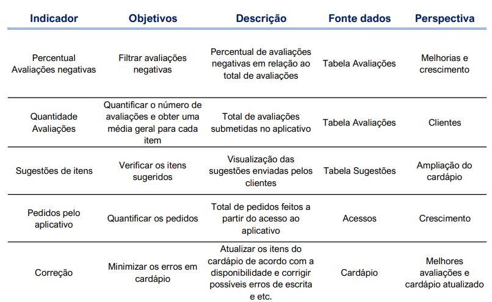

# Arquitetura da Solução

Pré-requisitos: <a href="3-Projeto de Interface.md"> Projeto de Interface</a>

Definição de como o software é estruturado em termos dos componentes que fazem parte da solução e do ambiente de hospedagem da aplicação.

## Processos e suas Respectivas Atividades
Nesta sessão, apresentaremos os modelos de gestão do projeto: BPMN, Tabelas, Gráficos ou Dashboards com no mínimo 5 indicadores de desempenho e metas para o processo de negócio e para o processo de desenvolvimento.

### Análise da Situação Atual

Atualmente em alguns bares, restaurantes, pizzarias etc., temos problemas com disponibilidade de cardápio, seja devido à demora de atendimento pelo garçom, ou por falta do cardápio em si. Além desse problema com a disponibilidade, ainda existe o problema com a manutenção, como o ajuste de valores, recuperação de danos, inclusão/exclusão de algum item etc. Como forma de melhoria para esse processo o cardápio digital solucionaria grande parte desses problemas, já que seria necessário apenas que o cliente baixe o app do estabelecimento e veja todo o cardápio, e o responsável por isso no estabelecimento faça o mesmo, porém com a função de adicionar itens ao cardápio. 

### Descrição Geral da Proposta

A proposta desenvolvida no projeto, trata-se de um app de cardápio em que os usuários possam apenas visualizar os itens, bem como seus valores, imagens, descrições etc., adicionados pelo responsável pela tarefa no estabelecimento. O projeto ficará limitado a isso devido ao nível de conhecimento da equipe não ser elevado e o tempo para a capacitação e desenvolvimento não ser o suficiente. Uma opção de melhoria para o projeto seria adicionar uma forma do usuário fazer um pedido baseado no número de sua mesa, sendo assim, o usuário master iria receber esse pedido e seria criado uma “comanda” digital.

### Processo 1 – Login do usuário master

Abrange o RF-001. 

### Processo 2 – CRUD do cardapio

Abrange os RF-001 e RF-002.

Com relação à metodologia atual de criação de cardápios em estabelecimentos, esse processo traz grandes melhorias em relação aos métodos antigos. Agora, não é mais necessário atualizar um conjunto inteiro de cardápios físicos quando há apenas uma alteração em um item específico, evitando rasuras e garantindo um nível maior de profissionalismo e informatização. Além disso, essa metodologia também ajuda a evitar custos desnecessários.

### Processo 3 – Visualização do cardapio

Abrange os RF-002, RF-003 e RF-004.

Tal processo traz consigo a melhoria de não depender mais de um garçom para trazer o cardápio até o cliente, permitindo até mesmo que ele visualize o cardápio de casa e planejar o que irá pedir com antecedência, o que resulta em um melhor planejamento.

### Processo 4 – Avaliação do item do cardapio

Abrange os RF-003, RF-004 e RF-006.

Esse processo permite um "compartilhamento" de opninão acerca de um item do cardapio, auxiliando os usuarios a escolher a melhor opção.

### Processo 5 – Enviar sugestões

Abrange o RF-007.

Permite que o usuário não necessite interagir pessoalmente com um gerente ou algum responsável para realizar alguma sugestão ou reclamação, dessa forma ajuda aqueles que são mais introspectivos a expressarem sua opinião

### Processo 6 – Visualizar sugestões

Abrange os RF-007 e RF-008.

## Indicadores de Desempenho

Indicadores de desempenho iniciais contemplando as funcionalidades previstas para serem desenvolvidas.

## Diagrama de Classes

O diagrama abaixo ilustra a relação entre classes e suas funcionalidades dentro do sistema..

## Modelo ER

O diagrama abaixo apresenta como as entidades se relacionam entre si na aplicação.

## Esquema Relacional

As tabelas que estruturam o sistema, bem como suas ligações, restrições de integridade e chaves estão descritas abaixo.

## Tecnologias Utilizadas

> - Linguagem de programação: JavaScript
> - Framework: React Native
> - Bibliotecas: Axios (para fazer requisições HTTP) e React Navigation (para navegação entre telas) 
> - Banco de dados: Json server
> - Ferramentas: Node.js (para executar o Json server), Expo (para facilitar o desenvolvimento e testes do aplicativo), VS Code (como IDE), Android Studio e Xcode (emuladores de Android e IOS) e Git (para controle de versão)

## Hospedagem

Explique como a hospedagem e o lançamento da plataforma foi feita.

> **Links Úteis**:
>
> - [Website com GitHub Pages](https://pages.github.com/)
> - [Programação colaborativa com Repl.it](https://repl.it/)
> - [Getting Started with Heroku](https://devcenter.heroku.com/start)
> - [Publicando Seu Site No Heroku](http://pythonclub.com.br/publicando-seu-hello-world-no-heroku.html)

## Qualidade de Software

A aplicação da qualidade de software é fundamental para garantir que o produto final atenda às necessidades dos usuários e seja entregue dentro do prazo e orçamento previstos. Além disso, a qualidade de software contribui para a manutenção e evolução do produto, gerando valor para o negócio. Segue baixo uma tabela contendo as principais características e subcaracterísticas de qualidade definidas pela norma ISO/IEC 25010 aplicadas a nosso projeto:

| Característica | Subcaracterísticas  | Justificativa |
|------|-----------------------------------------|----|
|Funcionalidade| Adequação, Acurácia, Interoperabilidade | É importante que o aplicativo atenda às necessidades do usuário admin, permitindo a criação, edição e remoção de itens do cardápio de forma adequada e precisa. Além disso, a interoperabilidade é importante para garantir que o aplicativo possa ser executado em diferentes plataformas de dispositivos móveis. | 
|Confiabilidade| Tolerância a falhas, Recuperabilidade | É importante que o aplicativo tenha alta disponibilidade e tolerância a falhas, garantindo que o usuário admin possa acessar o cardápio e fazer alterações a qualquer momento. Além disso, a recuperação de falhas é importante para garantir que os dados do cardápio sejam mantidos e recuperados em caso de falhas do sistema. | 
|Usabilidade| Facilidade de uso, Estética e design, Acessibilidade | É importante que o aplicativo seja fácil de usar e apresente um design atraente e intuitivo, garantindo que o usuário admin possa criar e gerenciar o cardápio com facilidade. Além disso, a acessibilidade é importante para garantir que o aplicativo possa ser utilizado por usuários com diferentes níveis de habilidade e necessidades especiais. |
|Eficiência de desempenho| Tempo de resposta, Consumo de recursos | É importante que o aplicativo seja rápido e responsivo durante a criação, edição e remoção de itens do cardápio, bem como na visualização do cardápio criado e sugestões dos clientes. Além disso, é importante que o aplicativo utilize recursos de hardware e software de forma otimizada, garantindo uma boa experiência de uso e evitando problemas de performance. |
|Manutenibilidade| Modularidade, Reusabilidade | É importante que o aplicativo seja fácil de manter e evoluir, permitindo que novas funcionalidades possam ser adicionadas no futuro. A modularidade e reusabilidade do código são importantes para garantir que o aplicativo possa ser facilmente mantido e atualizado sem afetar outras partes do sistema. |
|Portabilidade| Adaptabilidade, Instalabilidade | É importante que o aplicativo possa ser facilmente instalado em diferentes dispositivos móveis e plataformas. A adaptabilidade é importante para garantir que o aplicativo possa se adaptar a diferentes tamanhos de tela e resoluções. Além disso, a instalabilidade é importante para garantir que o aplicativo possa ser instalado sem problemas em diferentes dispositivos móveis. |
