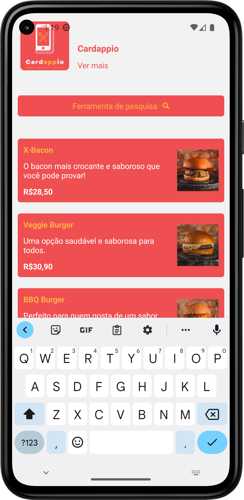
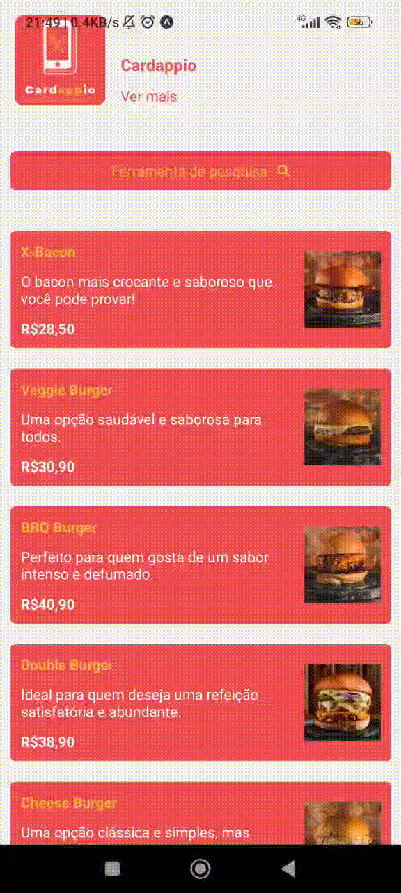
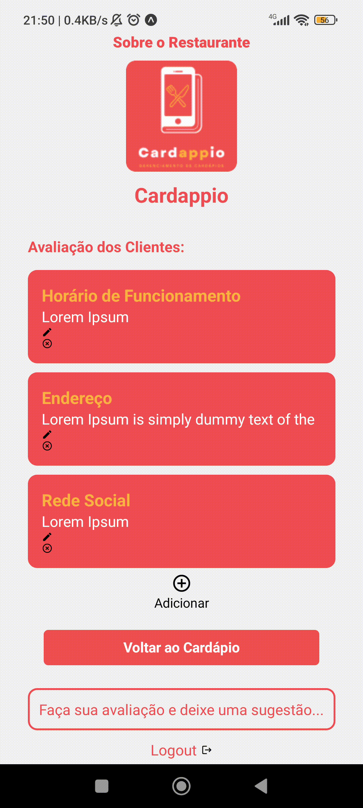
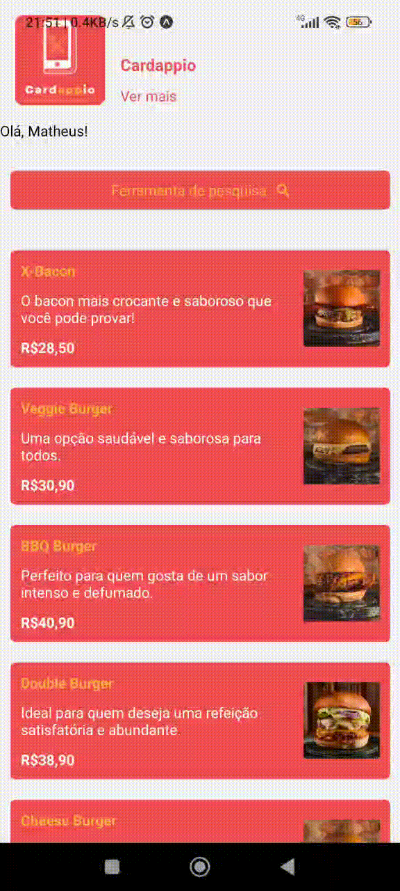

# Programação de Funcionalidades

Pré-requisitos: <a href="2-Especificação do Projeto.md"> Especificação do Projeto</a>, <a href="3-Projeto de Interface.md"> Projeto de Interface</a>, <a href="4-Metodologia.md"> Metodologia</a>, <a href="3-Projeto de Interface.md"> Projeto de Interface</a>, <a href="5-Arquitetura da Solução.md"> Arquitetura da Solução</a>

Implementação do sistema descrita por meio dos requisitos funcionais e/ou não funcionais. Deve relacionar os requisitos atendidos com os artefatos criados (código fonte), deverão apresentadas as instruções para acesso e verificação da implementação que deve estar funcional no ambiente de hospedagem.

Por exemplo: a tabela a seguir deverá ser preenchida considerando os artefatos desenvolvidos.

|ID    | Descrição do Requisito  |
|------|-----------------------------------------|
|RF-001| O aplicativo deve conceder ao usuário master uma forma de login.   |
|RF-002| O aplicativo deve conceder ao usuário master a opção de cadastrar /editar/excluir itens do cardápio digital.  |
|RF-003| O aplicativo deve permitir que o usuário visualize todos os itens cadastrados no cardápio digital (sejam eles alimentos ou bebidas) por meio de fotos. |
|RF-004| O aplicativo deve permitir que o usuário faça uma busca/filtre por um determinado item desejado no cardápio digital. |
|RF-005| O aplicativo deve apresentar a descrição e/ou composição do item selecionado pelo usuário. |
|RF-006| O aplicativo deve conceder ao usuário a opção de avaliar determinado item do cardápio.|
|RF-007| O aplicativo deve permitir que o usuário envie sugestões de forma anônima para o estabelecimento. | 
|RF-008| O aplicativo deve permitir que o usuário master visualize as sugestões anonimas enviadas pelos usuários.   |
|RF-009| O aplicativo deve permitir que o usuário master edite as informações sobre o restaurante.   |
|RNF-004| O aplicativo deve estar disponível também no idioma inglês.  |

# Artefatos Produzidos

## Home Cardápio
Na página inicial, o usuário pode visualizar a lista com os itens disponíveis no cardápio, bem como suas descrições e valores. (RF-003)

## Item
Ao selecionar um item, ele é expandido, melhorando a visualização dos detalhes. (RF-005)

## Pesquisa
É possível pesquisar por itens específicos utilizando a barra de busca/filtro. (RF-004)

## Login
Ao usuários admin, é possível realizar o login, utilizando e-mail e senha. (RF-001)

## Editar Informações
Uma vez conectado, o usuário master pode realizar alterações na descrição do restaurante (RF-009)

## Adicionar Item
Da mesma forma, é possível adicionar ou remover itens do cardápio, quando o usuário master está conectado ao aplicativo. (RF-002)

# Instruções de acesso

• Para hospedar nossa aplicação utilizamos a plataforma "---", cujo link de acesso encontra-se disponível através do URL: 

• Nossa aplicação conta com um usuário Admin para cadastros essenciais para um bom funcionamento do sistema.

• Para a visualização completa do sistema, é necessário estar cadastrado e logado na plataforma.  

